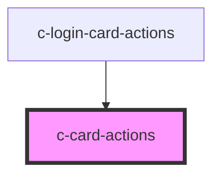

# c-card-actions

<!-- Auto Generated Below -->

## Properties

| Property  | Attribute | Description         | Type                                                                             | Default    |
| --------- | --------- | ------------------- | -------------------------------------------------------------------------------- | ---------- |
| `align`   | `align`   | Align the actions   | `"center" \| "end" \| "start"`                                                   | `'center'` |
| `justify` | `justify` | Justify the actions | `"center" \| "end" \| "space-around" \| "space-between" \| "start" \| "stretch"` | `'start'`  |

## Slots

| Slot | Description  |
| ---- | ------------ |
|      | Card actions |

## Dependencies

### Used by

 - [c-login-card-actions](../c-login-card-actions)

### Graph

----------------------------------------------

*Built with [StencilJS](https://stenciljs.com/)*
