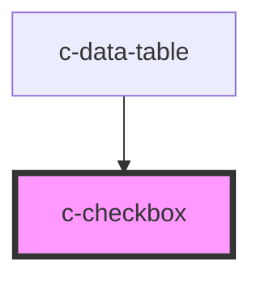

# c-checkbox

<!-- Auto Generated Below -->

## Properties

| Property        | Attribute       | Description                      | Type      | Default            |
| --------------- | --------------- | -------------------------------- | --------- | ------------------ |
| `disabled`      | `disabled`      | Disable the checkbox             | `boolean` | `false`            |
| `hideDetails`   | `hide-details`  | Hide the hint and error messages | `boolean` | `false`            |
| `hint`          | `hint`          | Hint text for the input          | `string`  | `''`               |
| `indeterminate` | `indeterminate` | Indeterminate state              | `boolean` | `false`            |
| `label`         | `label`         | Element label                    | `string`  | `''`               |
| `required`      | `required`      | Set as required                  | `boolean` | `false`            |
| `valid`         | `valid`         | Set the validity of the input    | `boolean` | `true`             |
| `validation`    | `validation`    | Custom validation message        | `string`  | `'Required field'` |
| `value`         | `value`         | Is the element checked           | `boolean` | `false`            |

## Events

| Event         | Description                                    | Type               |
| ------------- | ---------------------------------------------- | ------------------ |
| `changeValue` | Triggered when element is checked or unchecked | `CustomEvent<any>` |

## Slots

| Slot | Description                |
| ---- | -------------------------- |
|      | Default slot for the label |

## Dependencies

### Used by

 - [c-data-table](../c-data-table)

### Graph

----------------------------------------------

*Built with [StencilJS](https://stenciljs.com/)*
