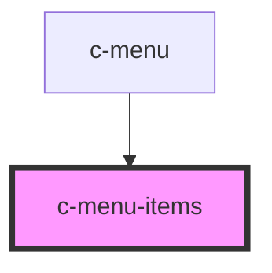

# c-muna-items

<!-- Auto Generated Below -->

## Properties

| Property       | Attribute        | Description                         | Type               | Default     |
| -------------- | ---------------- | ----------------------------------- | ------------------ | ----------- |
| `active`       | `active`         | Menu is opened and positioned       | `boolean`          | `false`     |
| `index`        | `index`          | is active                           | `number`           | `null`      |
| `items`        | --               | Menu items                          | `CMenuOption[]`    | `[]`        |
| `itemsPerPage` | `items-per-page` | Items per page before adding scroll | `number`           | `6`         |
| `parent`       | --               | Menu parent                         | `HTMLCMenuElement` | `undefined` |
| `parentType`   | `parent-type`    | Type of parent                      | `string`           | `'menu'`    |
| `small`        | `small`          | Small variant                       | `boolean`          | `false`     |
| `top`          | `top`            | Initial top position                | `number`           | `0`         |

## Events

| Event   | Description                       | Type                                                                                     |
| ------- | --------------------------------- | ---------------------------------------------------------------------------------------- |
| `close` | Triggered when the menu is closed | `CustomEvent<any>`                                                                       |
| `open`  | Triggered when the menu is opened | `CustomEvent<{ height: number; width: number; isInView: { x: boolean; y: boolean; }; }>` |

## Dependencies

### Used by

 - [c-menu](../c-menu)

### Graph

----------------------------------------------

*Built with [StencilJS](https://stenciljs.com/)*
