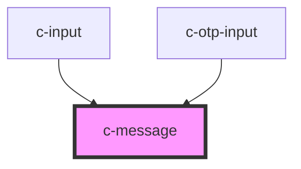

# c-message

<!-- Auto Generated Below -->

## Properties

| Property     | Attribute    | Description                     | Type      | Default            |
| ------------ | ------------ | ------------------------------- | --------- | ------------------ |
| `hint`       | `hint`       | Hint text for the input         | `string`  | `''`               |
| `inputId`    | `input-id`   | Id of the related input element | `string`  | `undefined`        |
| `valid`      | `valid`      | Parent validíty                 | `boolean` | `true`             |
| `validation` | `validation` | Custom validation message       | `string`  | `'Required field'` |

## Dependencies

### Used by

 - [c-input](../c-input)
 - [c-otp-input](../c-otp-input)

### Graph

----------------------------------------------

*Built with [StencilJS](https://stenciljs.com/)*
