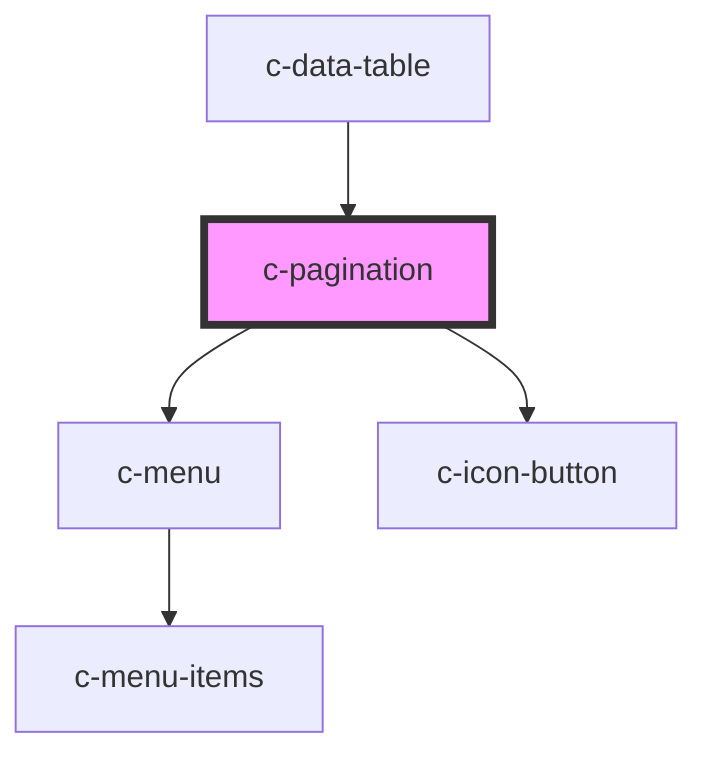

# c-pagination

<!-- Auto Generated Below -->

## Properties

| Property              | Attribute      | Description                                                                                                                                        | Type                   | Default                   |
| --------------------- | -------------- | -------------------------------------------------------------------------------------------------------------------------------------------------- | ---------------------- | ------------------------- |
| `hideDetails`         | `hide-details` | Hide details (per page dropdown and the 'x - y of n pages' text)                                                                                   | `boolean`              | `false`                   |
| `hideRange`           | `hide-range`   | Hide range indicator                                                                                                                               | `boolean`              | `false`                   |
| `itemsPerPageOptions` | --             | Items per page options                                                                                                                             | `number[]`             | `[5, 25, 50, 100]`        |
| `simple`              | `simple`       | Hide page number buttons                                                                                                                           | `boolean`              | `false`                   |
| `size`                | `size`         | Hide details (per page dropdown and the 'x - y of n pages' text)                                                                                   | `"default" \| "small"` | `'default'`               |
| `value`               | --             | Object containing values that are needed for pagination.  Note! startFrom and endTo are assigned automatically to the object based on other values | `CPaginationOptions`   | `{     itemCount: 0,   }` |

## Events

| Event         | Description                       | Type                              |
| ------------- | --------------------------------- | --------------------------------- |
| `changeValue` | Triggered when values are changed | `CustomEvent<CPaginationOptions>` |

## Dependencies

### Used by

 - [c-data-table](../c-data-table)

### Depends on

- [c-menu](../c-menu)
- [c-icon-button](../c-icon-button)

### Graph

----------------------------------------------

*Built with [StencilJS](https://stenciljs.com/)*
