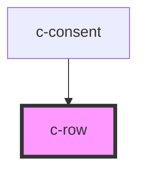

# c-row

<!-- Auto Generated Below -->

## Overview

Generic flex row component

## Properties

| Property  | Attribute | Description                  | Type                                                                | Default   |
| --------- | --------- | ---------------------------- | ------------------------------------------------------------------- | --------- |
| `align`   | `align`   | Align items vertically       | `"center" \| "end" \| "start"`                                      | `'start'` |
| `gap`     | `gap`     | Gap between items in px      | `number`                                                            | `0`       |
| `justify` | `justify` | Justify content horizontally | `"center" \| "end" \| "space-around" \| "space-between" \| "start"` | `'start'` |
| `nowrap`  | `nowrap`  | Disable flex wrap            | `boolean`                                                           | `false`   |

## Slots

| Slot | Description                                     |
| ---- | ----------------------------------------------- |
|      | Should contain items to be displayed in the row |

## Dependencies

### Used by

 - [c-consent](../c-consent)

### Graph

----------------------------------------------

*Built with [StencilJS](https://stenciljs.com/)*
