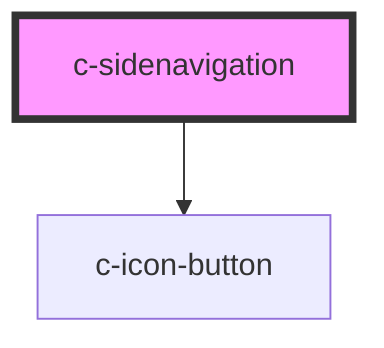

# c-sidenavigation

<!-- Auto Generated Below -->

## Properties

| Property      | Attribute      | Description                    | Type      | Default     |
| ------------- | -------------- | ------------------------------ | --------- | ----------- |
| `menuVisible` | `menu-visible` | Mobile version menu visibility | `boolean` | `false`     |
| `mobile`      | `mobile`       | Mobile version                 | `boolean` | `undefined` |

## Dependencies

### Depends on

- [c-icon-button](../c-icon-button)

### Graph

----------------------------------------------

*Built with [StencilJS](https://stenciljs.com/)*
