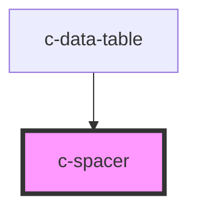

# c-spacer

<!-- Auto Generated Below -->

## Overview

Spacer component for flex containers

## Dependencies

### Used by

 - [c-data-table](../c-data-table)

### Graph

----------------------------------------------

*Built with [StencilJS](https://stenciljs.com/)*
