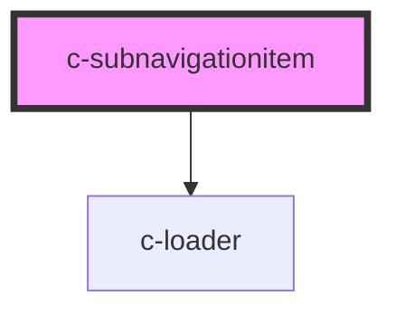

# c-subnavigationitem

<!-- Auto Generated Below -->

## Properties

| Property    | Attribute   | Description                      | Type      | Default     |
| ----------- | ----------- | -------------------------------- | --------- | ----------- |
| `active`    | `active`    | Active state                     | `boolean` | `undefined` |
| `focusable` | `focusable` | Element is visible and focusable | `boolean` | `false`     |
| `href`      | `href`      | Link url                         | `string`  | `undefined` |
| `loading`   | `loading`   | Loading state                    | `boolean` | `false`     |
| `target`    | `target`    | Link target                      | `string`  | `null`      |

## Dependencies

### Depends on

- [c-loader](../c-loader)

### Graph

----------------------------------------------

*Built with [StencilJS](https://stenciljs.com/)*
