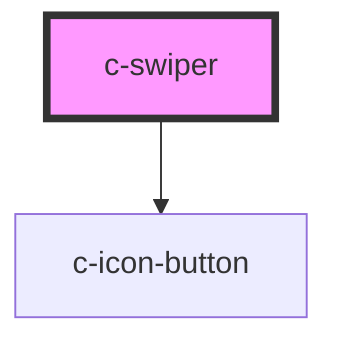

# c-tab-buttons

<!-- Auto Generated Below -->

## Properties

| Property | Attribute | Description         | Type               | Default     |
| -------- | --------- | ------------------- | ------------------ | ----------- |
| `value`  | `value`   | Value of the swiper | `number \| string` | `undefined` |

## Events

| Event         | Description                     | Type                            |
| ------------- | ------------------------------- | ------------------------------- |
| `changeValue` | Emit value change to the parent | `CustomEvent<number \| string>` |

## Slots

| Slot | Description                                |
| ---- | ------------------------------------------ |
|      | Default slot for the c-swiper-tab elements |

## Dependencies

### Depends on

- [c-icon-button](../c-icon-button)

### Graph

----------------------------------------------

*Built with [StencilJS](https://stenciljs.com/)*
