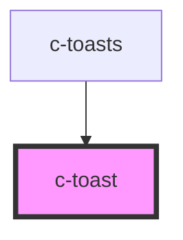

# c-toast

<!-- Auto Generated Below -->

## Properties

| Property  | Attribute | Description | Type            | Default     |
| --------- | --------- | ----------- | --------------- | ----------- |
| `message` | --        | Messages    | `CToastMessage` | `undefined` |

## Events

| Event   | Description                       | Type                         |
| ------- | --------------------------------- | ---------------------------- |
| `close` | Emit inner value change to parent | `CustomEvent<CToastMessage>` |

## Methods

### `closeToast() => Promise<void>`

Close toast

#### Returns

Type: `Promise<void>`

## Dependencies

### Used by

 - [c-toasts](../c-toasts)

### Graph

----------------------------------------------

*Built with [StencilJS](https://stenciljs.com/)*
