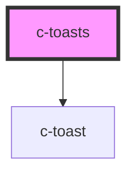

# c-toasts

<!-- Auto Generated Below -->

## Properties

| Property     | Attribute    | Description              | Type                            | Default    |
| ------------ | ------------ | ------------------------ | ------------------------------- | ---------- |
| `absolute`   | `absolute`   | Use absolute positioning | `boolean`                       | `false`    |
| `horizontal` | `horizontal` | Horizontal position      | `"center" \| "left" \| "right"` | `'center'` |
| `vertical`   | `vertical`   | Vertical position        | `"bottom" \| "top"`             | `'bottom'` |

## Methods

### `addToast(message: CToastMessage) => Promise<void>`

Add a new message

#### Returns

Type: `Promise<void>`

### `removeToast(id: string) => Promise<void>`

Remove a message by id (id should be specified in the addToast params)

#### Returns

Type: `Promise<void>`

## Dependencies

### Depends on

- [c-toast](../c-toast)

### Graph

----------------------------------------------

*Built with [StencilJS](https://stenciljs.com/)*
